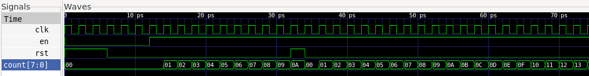
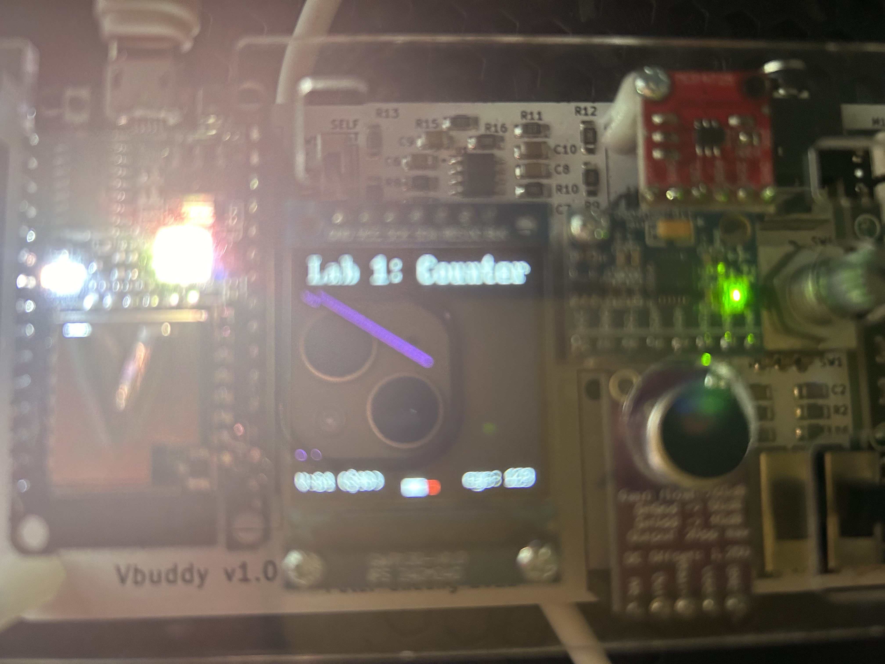
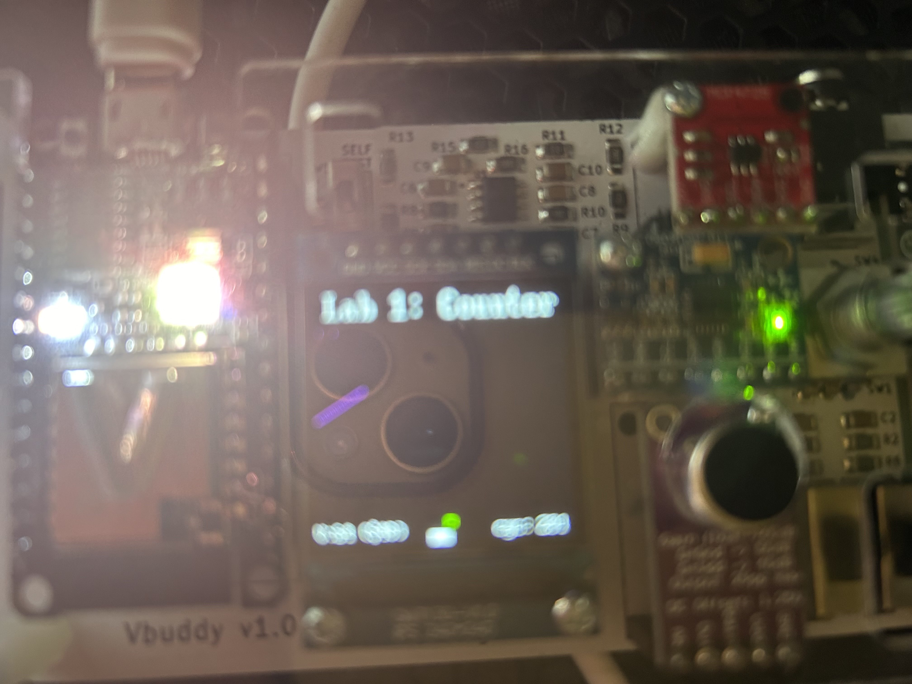

# IAC Logbook: Lab 1

## Table of contents
- [Task 1](#task-1)
- [Task 2](#task-2)

### Task 1
During this lab, EIE is introduced to digital design using SystemVerilog and Verilator. SystemVerilog is a Hardware Description Language,
and Verilator allows us to simulate a design written in SystemVerilog.

Here an example is given of a counter:

```Verilog
module counter #(
    parameter WIDTH = 8
) (
    input logic clk,
    input logic rst,
    input logic en,
    output logic [WIDTH-1:0] count
);

always_ff @(posedge clk)
    if (rst) count <= {WIDTH{1'b0}};
    else     count <= count + {{WIDTH-1{1'b0}}, en};
        
endmodule
```

And this produces the following waveform with the given testbench:


The first couple of lines are part of the module declaration, declaring the name of this module is counter, and that it has 3 inputs and 1 output; a clock signal as input,
a synchronous reset signal as input, an enable as input and the counter register as output.

When the counter is reset, it is set to all zeros, else the counter will transition to its current_value + 1  % 2^WIDTH in the next cycle. The % 2^WIDTH is to make it clear that this counter will overflow and cycle back to zero, like how they did back in Year 1 DECA.

### Task 2
Here we are connecting our counter up to our Vbuddy boards, which are essentially simulation assistants and help to both see and debug our designs.

We are also introduced to a couple of functions from vbuddy.cpp, like vbdPlot to plot a graph, vbdFlag to obtain the state of the push button switch on the rotary dial etc.

To do the challenge, you change what en does inside your counter, instead of en driving whether your counter goes up by 1 or stays as it is, instead it controls direction, so all it has to do is select between 1 and -1 as shown below:
```Verilog
module counter #(
    parameter WIDTH = 8
) (
    input logic clk,
    input logic rst,
    input logic en,
    output logic [WIDTH-1:0] count
);

always_ff @(posedge clk)
    if (rst) count <= {WIDTH{1'b0}};
    else     count <= count + (en ? {{WIDTH-1{1'b0}}, 1'b1} : {{WIDTH{1'b1}}});
        
endmodule
```

This works when you modify the testbench to have:
```C++
    top->en = vbdFlag();
```
and
```C++
    vbdPlot(int(top->count), 0, 255);
```


